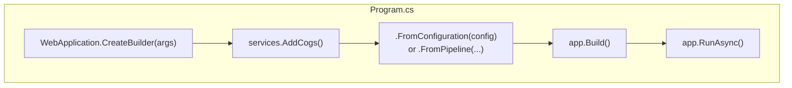
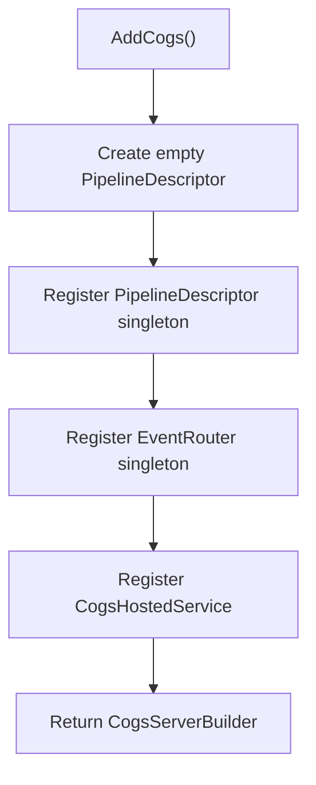
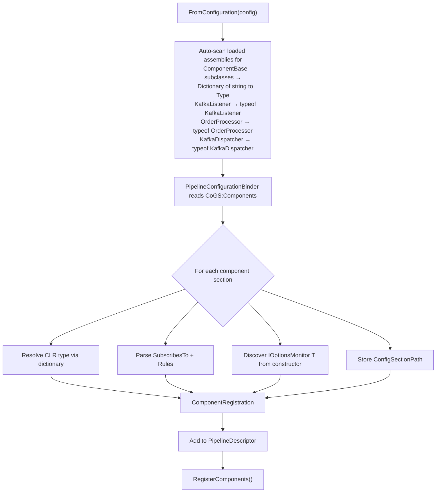
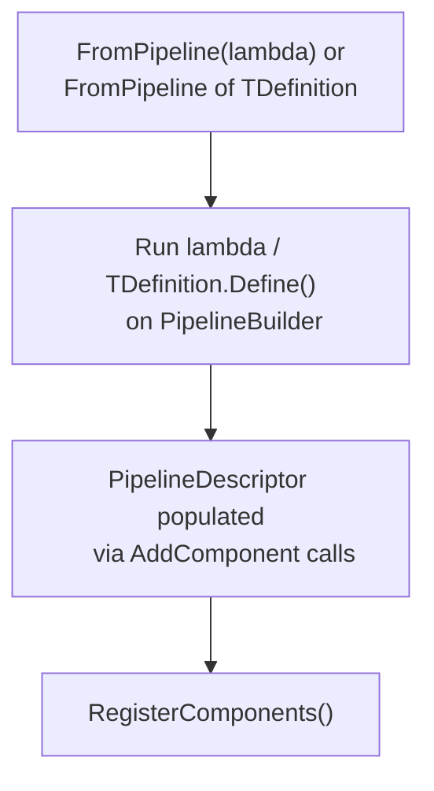
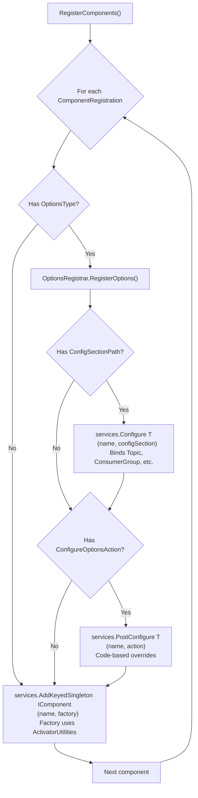
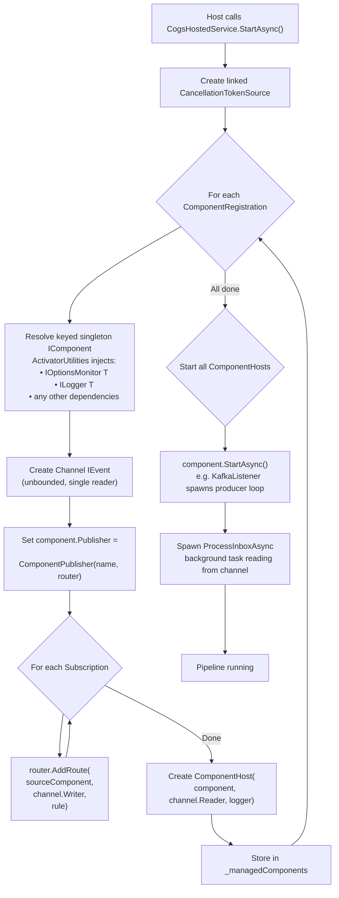
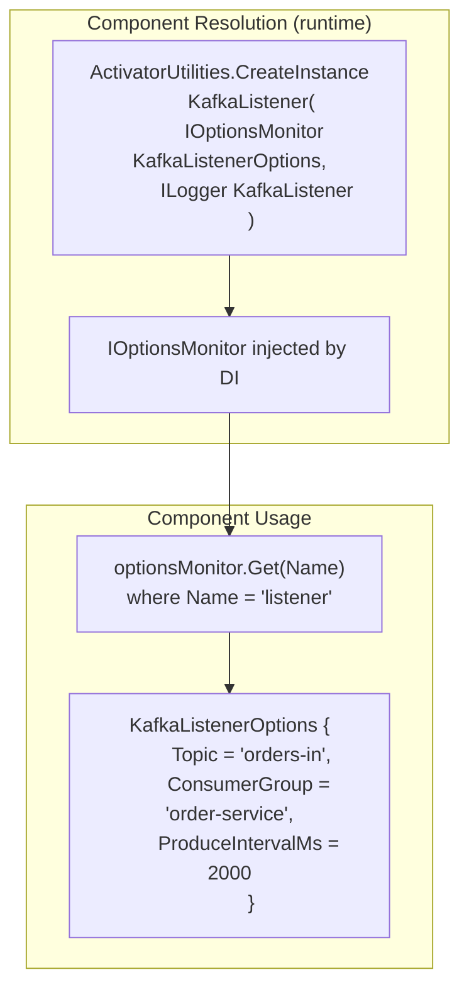
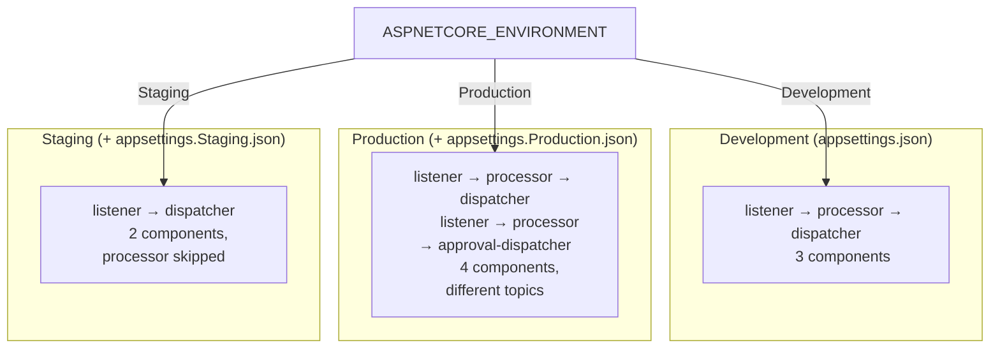

# CoGS Service Initialization

## Overview



## Phase 1a — `AddCogs()` (Server Infrastructure)



## Phase 1b — Pipeline Definition (Trigger)

### FromConfiguration path



### FromPipeline path



## Phase 2 — DI Registration (`RegisterComponents`)



## Phase 3 — Runtime Startup (`CogsHostedService.StartAsync`)



## Phase 4 — Runtime Event Flow

```mermaid
flowchart LR
    subgraph kafkaListener ["KafkaListener"]
        L_PRODUCE["ProduceEventsAsync loop"] --> L_PUBLISH["PublishAsync(OrderReceived)"]
    end

    subgraph eventRouter1 ["EventRouter"]
        L_PUBLISH --> ROUTE["RouteAsync('listener', event)"]
        ROUTE --> RULE_CHECK{"Rule: EventTypeRule
        OrderReceived?"}
        RULE_CHECK -- Pass --> WRITE_P["channel.Writer.WriteAsync
        → processor inbox"]
        RULE_CHECK -- Fail --> DROP1["Event dropped"]
    end

    subgraph orderProcessor ["OrderProcessor"]
        WRITE_P --> P_INBOX["ProcessInboxAsync reads event"]
        P_INBOX --> P_HANDLE["HandleEventAsync
        creates OrderProcessed"]
        P_HANDLE --> P_PUBLISH["PublishAsync(OrderProcessed)"]
    end

    subgraph eventRouter2 ["EventRouter"]
        P_PUBLISH --> ROUTE2["RouteAsync('processor', event)"]
        ROUTE2 --> RULE2{"Rule: EventTypeRule
        OrderProcessed?"}
        RULE2 -- Pass --> WRITE_D["channel.Writer.WriteAsync
        → dispatcher inbox"]
        RULE2 -- Fail --> DROP2["Event dropped"]
    end

    subgraph kafkaDispatcher ["KafkaDispatcher"]
        WRITE_D --> D_INBOX["ProcessInboxAsync reads event"]
        D_INBOX --> D_HANDLE["HandleEventAsync
        reads Options.Topic via
        optionsMonitor.Get(Name)
        logs dispatch"]
    end
```



## Options Pattern Flow

Options type is declared explicitly via the `[CogsComponent]` attribute:

```csharp
[CogsComponent("KafkaListener", OptionsType = typeof(KafkaListenerOptions))]
```

Three modes for providing option values:

```mermaid
flowchart TB
    subgraph configOnly ["Config-only (FromConfiguration)"]
        CO_ATTR["Attribute declares OptionsType"] --> CO_SECTION["Bind config section
        CoGS:Components:listener"]
        CO_SECTION --> CO_CONFIGURE["services.Configure
        KafkaListenerOptions
        ('listener', section)"]
    end

    subgraph pureCode ["Pure fluent (FromPipeline)"]
        PC_CALL[".Configure of KafkaListenerOptions
        (opts => ...)"] --> PC_POST["services.PostConfigure
        KafkaListenerOptions
        ('listener', action)"]
    end

    subgraph hybrid ["Hybrid (FromPipeline with config)"]
        HY_SECTION["Bind config section
        CoGS:Components:listener"] --> HY_CONFIGURE["services.Configure
        (base values from config)"]
        HY_CONFIGURE --> HY_CALL[".Configure of KafkaListenerOptions
        (opts => ...)"]
        HY_CALL --> HY_POST["services.PostConfigure
        (code overrides applied on top)"]
    end
```





## Environment-Specific Topology


